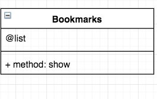

## User Story

```
As a user,
So I can save important webpages,
I would like to see a list of bookmarks.
```


## Setup

Setting up the SQL database

```
> psql postgres
> CREATE DATABASE bookmark_manager;
> \c bookmark_manager
> CREATE TABLE bookmarks(id SERIAL PRIMARY KEY, url VARCHAR(60));
```
